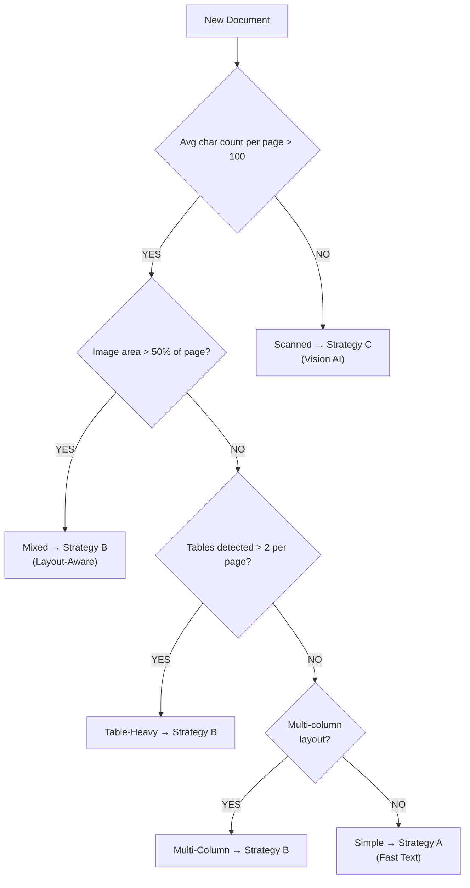
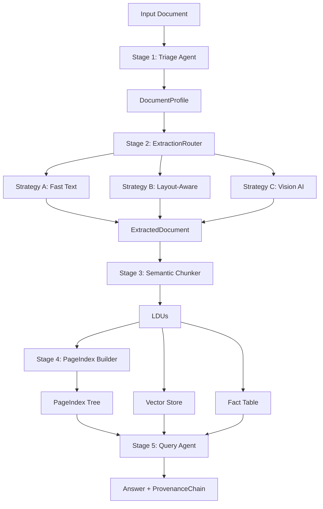

## 1. Extraction Strategy Decision Tree

Based on empirical analysis of the 4 corpus documents:

### Empirical Justification

- Class B had < 20 chars per page on average → scanned.
- Class A had mixed pages (0 chars + 1500+ chars) → hybrid.
- Class C had 3000–5000+ chars per page → clearly digital.
- Class D had consistent digital text but dense numeric tables.

Routing must happen at **page-level**, not only document-level.

---

## 2. Failure Modes Observed

---

### Class A — CBE Annual Report (Hybrid Digital)

**Observations:**

- Some pages (cover, final page) had zero extractable text.
- Core pages had 800–2000+ characters.
- Tables were detected in financial sections.
- Minor encoding artifacts (`Â`) present.

**Table Behavior:**

- Headers generally aligned with numeric data.
- Financial values extracted correctly.
- Multi-row headers occasionally split across rows.

**Layout Behavior:**

- Multi-column sections exist.
- Possible interleaving risk if naive text concatenation is used.

**Failure Modes:**

- Encoding artifacts require cleanup.
- Hybrid nature requires page-level OCR fallback.
- Multi-column pages may require layout-aware extraction.

**Conclusion:**
Strategy B (Layout-Aware) with selective OCR fallback.

---

### Class B — DBE Audit Report (Scanned)

This is the most critical discovery.

**Observations:**

- 6/7 sampled pages had zero characters.
- Image area ~100% per page.
- No tables detected.
- Extracted text layer effectively nonexistent.

**Failure Mode:**

- pdfplumber extraction fails completely.
- Table detection impossible.
- Downstream chunking would silently ingest empty content.

**Conclusion:**
Requires Strategy C (Vision AI / OCR).
Direct extraction is non-viable.

This document defines the OCR routing boundary.

---

### Class C — FTA Assessment (Clean Digital, Structured)

**Observations:**

- High character density (0.008–0.01).
- Thousands of characters per page.
- Multiple tables detected reliably.
- Clear hierarchical structure visible in text extraction.

**Table Behavior:**

- Extracted tables generally well-formed.
- Some small tables split across pages.
- Numeric values preserved accurately.

**Failure Modes:**

- Some small tables detected as 1-row artifacts.
- Minor header fragmentation in complex layouts.

**Conclusion:**
Strategy B (Layout-Aware) preferred for structured parsing.
Strategy A possible but may lose table structure.

---

### Class D — Tax Expenditure (Numeric-Heavy, Table-Dense)

**Observations:**

- Consistent digital text extraction.
- Dense numeric tables (10–12 columns).
- Multi-row headers split into fragments.
- Many empty cells in extracted output (header alignment artifacts).

**Table Behavior:**

- All numeric values appear present.
- Columns sometimes misaligned.
- Header rows fragmented across multiple rows.

**Failure Modes:**

- Complex table headers broken into separate rows.
- Blank cells where merged cells existed in PDF.
- Multi-page table continuity not preserved automatically.

**Conclusion:**
Strategy B required.
Post-processing logic needed for header reconstruction and column alignment.

---

## 3. Threshold Values (Empirically Determined)

| Metric                           | Threshold     | Rationale                                              |
| -------------------------------- | ------------- | ------------------------------------------------------ |
| `min_char_count_per_page`        | 100           | Below this, pages behave like scanned images (Class B) |
| `max_image_area_ratio`           | 0.50 (50%)    | Above this, page is image-dominated                    |
| `min_table_detection_per_sample` | 2 tables/page | Above this suggests table-heavy document               |
| `low_char_density`               | < 0.0005      | Strong signal of scanned page                          |
| `high_char_density`              | > 0.005       | Strong signal of digital structured page               |

These values are derived directly from observed distributions in Classes A–D.

---

## 4. Pipeline Architecture Diagram

Key Insight:
Extraction must precede semantic chunking. Poor extraction leads to garbage LDUs.

---

## 5. Cost Analysis (Estimated)

| Strategy         | Cost per Page | Cost for 161-page Doc | When Used                       |
| ---------------- | ------------- | --------------------- | ------------------------------- |
| A (Fast Text)    | ~$0.00        | ~$0.00                | Clean digital, simple layout    |
| B (Layout-Aware) | ~$0.002       | ~$0.32                | Multi-column, structured tables |
| C (Vision AI)    | ~$0.03–0.10   | ~$4.83–16.10          | Scanned, image-based PDFs       |

Observation:

- Running Strategy C on all documents would be wasteful.
- Class B justifies OCR cost.
- Others do not.

Routing significantly reduces compute cost.

---

## 6. Tools Evaluated

| Tool | Tested | Notes |

## 6. Tools Evaluated: Docling vs. pdfplumber

Based on Phase 0 exploration, we compared the lightweight `pdfplumber` against the heavyweight `Docling`.

### Performance & Comparison Table

| Metric                | pdfplumber                           | Docling                              |
| --------------------- | ------------------------------------ | ------------------------------------ |
| **Class A (CBE)**     | High speed, misses complex structure | 35m conversion, 182 tables found     |
| **Class B (Scanned)** | **FAILED (0 chars extracted)**       | **SUCCESS (481k chars, 114 tables)** |
| **Class C (FTA)**     | Good text, basic tables              | 26m conversion, 59 tables found      |
| **Class D (Tax)**     | Good text, alignment issues          | 6m conversion, 29 tables found       |
| **Extraction Speed**  | Near-instant (<1s per page)          | Very slow (15-60s per page)          |
| **Structure**         | Flat text stream                     | Rich Markdown with TOC + Tables      |

### Key Findings

1.  **The "Scanned" Breakthrough:** Docling successfully OCR'ed the image-only Class B document (`Audit Report - 2023.pdf`), which was completely invisible to `pdfplumber`. This confirms that while expensive (time/compute), a layout-aware/OCR-enabled model is mandatory for our corpus.
2.  **Table Fidelity:** Docling's markdown export preserves complex table hierarchies and merged cells much better than `pdfplumber`'s raw grid extraction.
3.  **Escalation Boundary:** `pdfplumber` is useful for the **Triage Agent** (to quickly detect char density), while `Docling` or `MinerU` should be the production default for **Strategy B/C**.

---

# Final Phase 0 Conclusion

The corpus is structurally heterogeneous and represents a "worst-case" scenario for simple extraction.

**Final Recommendations for Pipeline:**

1.  **Mandatory OCR/VLM:** Class B confirms we cannot rely on text-layer extraction alone.
2.  **Phase-Level Routing:** Using `pdfplumber` in the Triage stage to check `char_density < 100` is an effective way to flag documents for "Strategy C" (Vision AI/OCR) before wasting compute.
3.  **Markdown as Intermediate Format:** Docling's markdown output is a superior input for the **Semantic Chunker** compared to raw text, as it preserves structural delimiters (`#`, `|`, `<!-- image -->`).
4.  **Compute Warning:** Docling is resource-intensive. Conversion of the 161-page CBE report took over 30 minutes. The production pipeline must support asynchronous/background processing.
