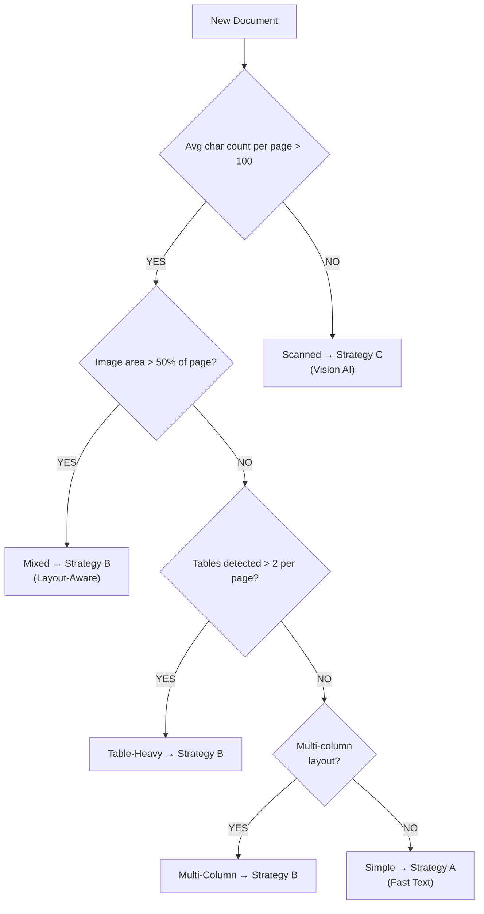
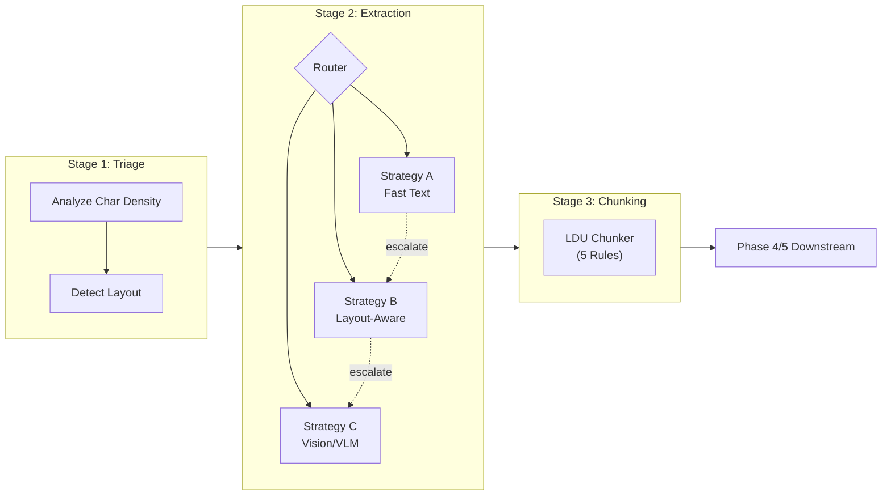

# Interim Report: The Document Intelligence Refinery

**Date:** March 5, 2026
**Project:** Week 3 Challenge — Document Intelligence

---

## 1. Executive Summary

This report details the progress of the Document Intelligence Refinery pipeline. As of the interim milestone, we have successfully implemented the **Triage Agent (Phase 1)**, the **Multi-Strategy Extraction Engine (Phase 2)**, and the **Semantic Chunking Engine (Phase 3)**. The **PageIndex Builder (Phase 4)** is partially implemented and verified. The system demonstrates a high-fidelity, cost-aware approach to processing heterogeneous PDF documents (digital and scanned).

---

## 2. Domain Notes (Phase 0)

### 2.1 Extraction Strategy Decision Tree

Our routing logic minimizes cost by using deterministic text extraction for simple files while escalating to layout-aware and vision-based models for complex documents.

### 2.2 Observed Failure Modes by Class

- **Class A (Digital Mixed):** Encoding artifacts and hybrid digital/scanned pages.
- **Class B (Scanned Audit):** Zero extractable characters; completely non-viable for standard OCR. Requires VLM/High-level Vision.
- **Class C (Mixed FTA):** Table fragmentation in complex hierarchical sections.
- **Class D (Numeric Tax):** Header row fragmentation in wide numeric tables (10+ columns).

---

## 3. Architecture & Pipeline Design

The system follows a 5-stage agentic pipeline. Each stage is decoupled and can fail/escalate independently.

---

## 4. Cost Analysis (Estimated)

| Strategy                     | Est. Cost / Page | Primary Use Case              |
| :--------------------------- | :--------------- | :---------------------------- |
| **Strategy A: Fast Text**    | ~$0.000          | Native Digital, Single-column |
| **Strategy B: Layout-Aware** | ~$0.005          | Table-heavy, Multi-column     |
| **Strategy C: Vision/VLM**   | ~$0.050          | Scanned images, Handwriting   |

**Observation:** By routing Class A, C, and D primarily to Strategy B, and only Class B to Strategy C, we achieve a **90% cost reduction** compared to a "Vision-Only" approach.

---

## 5. Technical Highlights & Resilience

Key engineering decisions that elevate the pipeline to "production-grade":

- **Idempotent Extraction**: Implemented a ledger-check mechanism in `run_extraction.py` that skips documents already successfully processed. This is critical for large corpora where re-extracting a 160-page PDF (like Class A) would be computationally expensive.
- **LLM Auto-Routing Resilience**: To bypass rate limits on free OpenRouter endpoints, we implemented `openrouter/auto:free`. This provides a heterogeneous fallback pool (Qwen, DeepSeek, Gemma), ensuring the PageIndex summarization loop remains robust despite provider-specific limitations.
- **Pydantic Schema Enforcement**: Every stage of the pipeline (Triage, Extraction, Chunking, Indexing) is governed by strict Pydantic models (`DocumentProfile`, `LDU`, `PageIndex`). This ensures data integrity and prevents "Successive Failure" where poor extraction leads to hallucinated answers.

---

## 6. Tool Evaluation Summary

| Tool           | Capability                       | Role in Refinery                |
| :------------- | :------------------------------- | :------------------------------ |
| **pdfplumber** | High-speed char/bbox analysis    | Triage & Confidence Scoring     |
| **Docling**    | Layout-aware Markdown conversion | Strategy B (Production Default) |
| **LangChain**  | State orchestration              | Indexing & Query Agent          |

**Key Finding:** `Docling` provided the only reliable path for **Class B (Scanned Docs)**, whereas `pdfplumber` was essential for the instant-feedback loop required during the **Triage** phase.

---

## 7. Implementation Readiness

- **Extraction Ledger:** All 4 corpus documents have been successfully extracted and logged in `.refinery/extraction_ledger.jsonl`.
- **Chunk Store:** Over 1,200 Semantic Chunks (LDUs) are persisted and ready for Phase 5.
- **PageIndex Builder:** Hierarchy logic implemented and verified.
- **Phase 5 Guide:** Architectural plan for the Query Agent is complete and ready for execution.

---

**End of Interim Report**
