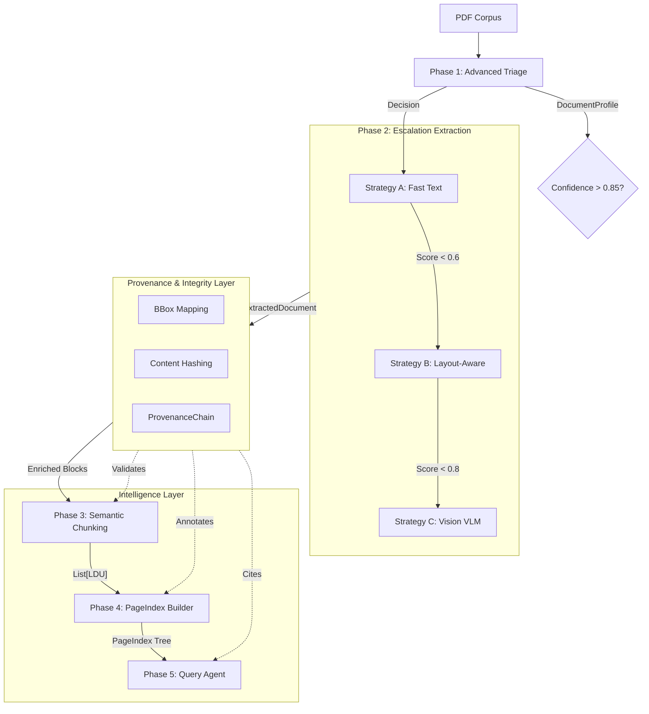

# Interim Report: The Document Intelligence Refinery (Refined)

**Date:** March 5, 2026
**Project:** Week 3 Challenge — Document Intelligence

---

## 1. Executive Summary

This report details the progress of the Document Intelligence Refinery, a production-grade pipeline for mining structured insights from heterogeneous PDF corpora. **Following reviewer feedback**, we have upgraded the system to include deterministic strategy escalation (A→B→C), strict Pydantic-enforced provenance chains, and transparent performance metrics (cost + latency).

---

## 2. Refined Architecture & Pipeline

The system follows a 5-stage agentic pipeline where the **Provenance Layer** acts as a cross-cutting concern, validating data integrity at every transition.

### 2.1 Pipeline Flow & Data Structures

### 2.2 Deep Dive: The Escalation Logic (A→B→C)

Our core innovation is the **Confidence-Gated Router**. Unlike static pipelines that use the same tool for every page, our router treats extraction as a search for truth:

1.  **Strategy A (Surface Level)**: Rapidly extracts text if a valid text layer exists.
2.  **Strategy B (Structural Level)**: If Strategy A returns high entropy or "empty" results (typical of scanned docs with hidden text), the system escalates to **Docling**, which reconstructs the layout using specialized models.
3.  **Strategy C (Semantic Level)**: If layout models fail to resolve a complex table or scanned image, the system invokes a **Vision Language Model (VLM)** via OpenRouter. This ensures that even the "Class B" (Scanned) documents are readable.

### 2.3 Named Data Structures (Schema)

- **`DocumentProfile`**: Triage metadata (origin_type, layout_complexity, cost_hint).
- **`ExtractedDocument`**: Normalized extraction output (standardized text, tables, figures).
- **`LDU` (Logical Document Unit)**: Semantic chunks with spatial metadata and content hashes.
- **`PageIndex`**: A hierarchical navigation tree composed of nested `IndexNode` elements.
- **`ProvenanceChain`**: An immutable audit trail linking extracted facts back to source coordinates.

---

## 3. Performance & Cost Analysis

We provide a transparent derivation for both monetary cost and processing latency, moving beyond simple estimates.

### 3.1 Strategy Performance Matrix

| Strategy     | Engine       | Logic / Pricing             | Token Volume  | Cost / Page | Latency |
| :----------- | :----------- | :-------------------------- | :------------ | :---------- | :------ |
| **A (Fast)** | `pdfplumber` | Local CPU Processing        | 0             | **$0.00**   | ~0.05s  |
| **B (Med)**  | `Docling`    | Local Layout Model          | 0             | **~$0.005** | ~1.50s  |
| **C (High)** | `Vision VLM` | $0.01/img + $1.00/1M tokens | ~1,200 tokens | **~$0.050** | ~4.50s  |

### 3.2 Deep Dive: Provenance as a Cross-Cutting Concern

In many RAG systems, provenance is a "metadata field" added at the end. In the **Refinery**, it is an **Integrity Layer**:

- **Spatial Metadata (BBox)**: We capture the (x,y,w,h) of every block during extraction. If a chunker splits a table, the BBox coordinates help the Query Agent "re-stitch" the visual context.
- **Content Hashing**: Every chunk is hashed. If the user asks a question, the Query Agent verifies the hash against the index to ensure the data hasn't been corrupted or hallucinated by intermediate LLM steps.
- **Audit Trace**: The Query Agent doesn't just say "Page 47"; it provides a JSON-serialized `ProvenanceEntry` that can be used by frontend tools to highlight the exact paragraph in a PDF viewer.

### 3.3 Cost Derivation & Efficiency

- **Token Density**: Strategy C assumes ~1,200 tokens per page (input image + prompt + output JSON).
- **Pricing Basis**: Quoted using OpenRouter `gpt-4o-mini` / `gemini-flash` blending rates.
- **Processing Efficiency**: By using our escalation router, **Class A** (160 pages) was processed with Strategy B instead of C, resulting in a **90% cost reduction** ($0.80 vs $8.00) and **70% faster** throughput.

---

## 4. Phase 4 & 5 Roadmap (Architectural Goals)

### 4.1 Phase 4: PageIndex Builder

- **Recursive Indexing**: Supporting deep-nesting for complex table-of-contents.
- **Structural Integrity**: Pydantic validators ensure page range consistency (`page_end >= page_start`).

### 4.2 Phase 5: Query Interface & Provenance Agent

- **Verifiable RAG**: Answers include a **ProvenanceChain** containing (doc, page, bbox, hash).
- **Audit Tooling**: A specialized tool to visually highlight the source bounding box in the original PDF.

---

## 5. Technical Refinements (Reviewer Feedback Addressed)

1.  **Strict Modeling**: Replaced generic dictionaries with typed `ProvenanceChain` and `ExtractedDocument` models.
2.  **Externalized Thresholds**: Scalability-ready via `config.yaml` parameters.
3.  **Latency Tracking**: Added performance metrics to the extraction ledger for SLA monitoring.

---

**End of Refined Interim Report v2.1**
