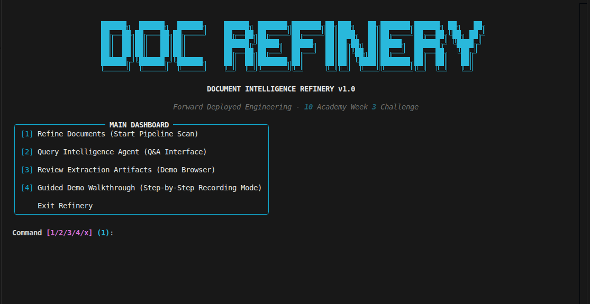
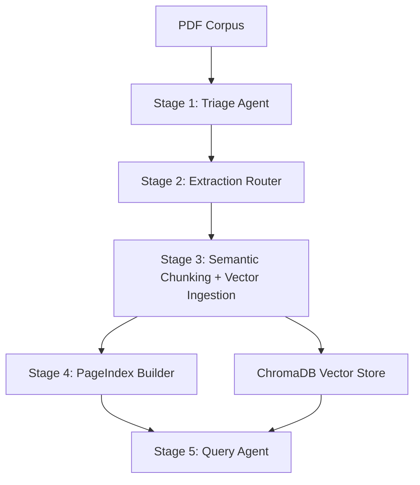

# Document Intelligence Refinery

Production-grade, multi-stage agentic pipeline for document extraction, semantic chunking, and provenance-tracked querying. Built for the **10Academy Week 3 FDE Challenge**.

---

## Overview

The **Document Intelligence Refinery** solves the "last mile" problem of enterprise intelligence: extracting structured, verifiable data from heterogeneous document formats (digital PDFs, scanned images, complex layouts) while maintaining full provenance.

### Key Features

- **Triage Agent** — Classifies documents by origin (digital/scanned/mixed), layout complexity, and domain.
- **Multi-Strategy Extraction (A→B→C)** — Routes documents through a confidence-gated escalation pipeline: Fast Text → Layout-Aware (Docling) → Vision VLM.
- **Semantic Chunking** — Implements 5 enforced **Logical Document Unit (LDU)** rules to preserve table integrity and section context.
- **PageIndex Builder** — Generates a hierarchical navigation tree with LLM-powered section summaries.
- **Query Agent** — LangGraph agent with 3 tools: `pageindex_navigate`, `semantic_search`, `structured_query`.
- **Provenance-First Design** — Every chunk carries spatial metadata (BBox), content hashes, and page references for 100% traceability.
- **Audit Mode** — Verify claims against source citations or flag as "unverifiable".

### Target Corpus

| Class | Document                       | Type                      |
| :---- | :----------------------------- | :------------------------ |
| A     | CBE Annual Report 2023–24      | Native digital, 161 pages |
| B     | Audit Report – 2023 (DBE)      | Scanned image             |
| C     | FTA Performance Survey 2022    | Mixed text + tables       |
| D     | Tax Expenditure Report 2021/22 | Table-heavy numerical     |

---

## Quick Start

### 1. Clone & Setup

```bash
git clone https://github.com/Mistire/document-intelligence-refinery.git
cd document-intelligence-refinery
python3 -m venv .venv
source .venv/bin/activate
pip install -e .
```

### 2. Environment Variables

Create a `.env` file in the project root:

```env
OPENROUTER_API_KEY=your_key_here
OPENROUTER_URL="https://openrouter.ai/api/v1"
MODEL_NAME="arcee-ai/trinity-large-preview:free"
```

### 3. Launch the Refinery

```bash
python3 main.py
```

This opens the **Interactive TUI Dashboard** with four options:

| Option | Description                                                                              |
| :----- | :--------------------------------------------------------------------------------------- |
| `[1]`  | **Refine Documents** — Run the full pipeline (Triage → Extraction → Chunking → Indexing) |
| `[2]`  | **Query Intelligence Agent** — Ask questions about any processed document                |
| `[3]`  | **Review Artifacts** — Browse triage profiles, extraction ledger, and PageIndex trees    |
| `[4]`  | **Guided Demo Walkthrough** — Step-by-step demo mode with integrated explanations        |

---

## Pipeline Architecture



### Extraction Strategy Escalation

```
Strategy A (pdfplumber) → confidence < 0.85 → Strategy B (Docling) → confidence < 0.70 → Strategy C (Vision VLM)
```

---

## Project Structure

```
├── main.py                     # Interactive TUI Dashboard
├── run_pipeline.py             # Full pipeline orchestrator
├── config.yaml                 # Externalized thresholds & budgets
├── rubric/extraction_rules.yaml# Chunking constitution
├── src/
│   ├── models/                 # Pydantic schemas (DocumentProfile, LDU, PageIndex, ProvenanceChain)
│   ├── agents/                 # Triage, Chunker, Indexer, Query Agent
│   ├── extraction/             # Router, Strategies (A/B/C), FactTable, Ledger
│   └── utils/                  # VectorStoreManager (ChromaDB + HuggingFace embeddings)
├── scripts/                    # Individual stage runners
├── .refinery/                  # Pipeline artifacts (profiles, extractions, chunks, indexes, chroma)
└── tests/                      # Unit tests
```

---

## Manual Stage Execution

For granular control, run stages individually:

```bash
python3 scripts/run_triage.py --file "CBE ANNUAL REPORT 2023-24.pdf"
python3 scripts/run_extraction.py --file "CBE ANNUAL REPORT 2023-24"
python3 scripts/run_chunking.py --file "CBE ANNUAL REPORT 2023-24"
python3 scripts/run_indexing.py --file "CBE ANNUAL REPORT 2023-24"
```

---

## Documentation

| Document                                   | Description                                                                         |
| :----------------------------------------- | :---------------------------------------------------------------------------------- |
| [FINAL_REPORT.md](./FINAL_REPORT.md)       | Complete submission report with architecture, quality analysis, and lessons learned |
| [INTERIM_REPORT.md](./INTERIM_REPORT.md)   | Refined architecture and cost analysis                                              |
| [DOMAIN_NOTES.md](./DOMAIN_NOTES.md)       | Phase 0 research: decision tree, failure modes, cost tradeoffs                      |
| [LESSONS_LEARNED.md](./LESSONS_LEARNED.md) | Engineering journal with failure/fix cases                                          |

---

## Tech Stack

| Component    | Technology                                   |
| :----------- | :------------------------------------------- |
| Extraction   | pdfplumber, Docling, OpenRouter VLM          |
| Chunking     | Custom SemanticChunker with 5 LDU rules      |
| Embeddings   | HuggingFace `all-MiniLM-L6-v2` (local, free) |
| Vector Store | ChromaDB                                     |
| Query Agent  | LangGraph + LangChain                        |
| FactTable    | SQLite                                       |
| TUI          | Rich                                         |
| Schemas      | Pydantic v2                                  |

---

_Forward Deployed Engineering — 10 Academy Week 3 Challenge_
